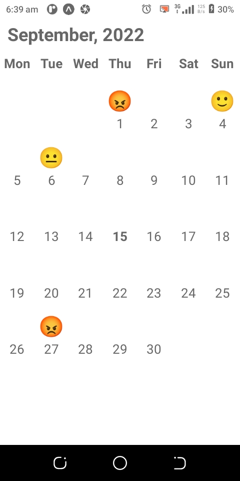

# Simple Calendar Component

> An implementaion of a simple calendar that can display one's mood in a day.



## Built With

- React Native
- Expo

## Live Demo

[Open Link](https://expo.dev/artifacts/eas/g9mdkvYiUVCQCJi6V7eL8J.apk) on your android mobile device to install the application.

## Getting Started

To get a local copy up and running follow these steps on the command line.

```bash

  # Clone the project from it's github repo.

  $ git clone https://github.com/chasscepts/simple-calendar

  # Change directory to the root of project

  $ cd simple-calendar

  # Install all dependencies

  $ npm install

  # Open app in a connected mobile device

  $ npm run start

  # To run the tests

  $ npm run test

```

# Building the project for production

Please follow the instructions [here](https://docs.expo.dev/build/setup/) to build the project

## Authors

👤 **Obetta Francis**

[](https://github.com/chasscepts) [](https://twitter.com/chasscepts) [](https://www.linkedin.com/in/chasscepts/)

## 🤝 Contributing

Contributions, issues, and feature requests are welcome!

Feel free to check the [issues page](https://github.com/chasscepts/simple-calendar/issues).

## Show your support

Give a ⭐️ if you like this project!

## Acknowledgments
- [Custxmer Team](https://www.custxmer.com/)
- Everyone whose code was used in this project

## 📝 License

This project is [MIT](./LICENSE) licensed.
